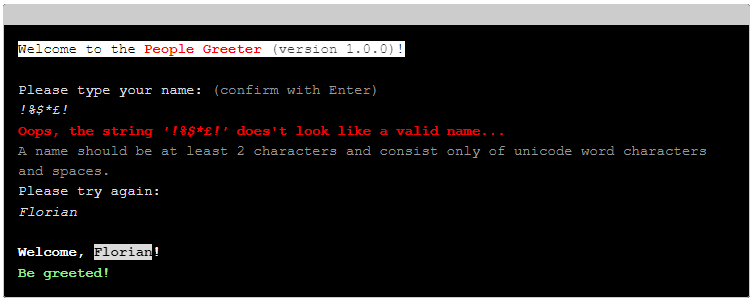

# The ANSI Terminal Markup Language (AnTeML)

**AnTeML** (pronounced /ˈænˌtiː ˈɛm ˈɛl/, like "anti-ML") is a stack-based HTML-like mini-language for encoding text with ANSI X3.64 Control Sequences.

## Why AnTeML?
The primary purpose of AnTeML is to provide a more intuitive and easy to use interface to ANSI terminal controls for developers of command-line interfaces (CLIs).

While there are other great tools for this available, such as the [`colorama`](https://pypi.org/project/colorama/) package by Jonathan Hartley and Arnon Yaari, it's often been my feeling that using these in practice is more demanding and cumbersome than what is needed to make simple CLI interfaces better for the user through the use of simple ANSI control sequences to set things like color, text mode, etc.

To this end, AnTeML provides a HTML-like syntax that will be intuitively familiar to most developers, implementing a stack-based continuous parser which can keep track of the state of various control sequences in the background to isolate the developer as much as possible from having to keep track of things such as color codes or text-modes that might overwrite other effects to which one might want to revert later.

To illustrate this, compare the following short examples. These both produce the same output, one using `colorama`, the other `anteml`:

**Example using `colorama`:**
```python
import re
import sys
from colorama import init as init_colorama, Fore, Back, Style
from typing import Pattern

version: str = "1.0.0"
name_pattern: Pattern[str] = re.compile(
    r"\A\w[\w ]+\w\Z",
    re.UNICODE
)
init_colorama()

print(
    f"{Fore.BLACK}{Back.WHITE}Welcome to the {Style.BRIGHT}{Fore.RED}People "
    f"Greeter{Fore.BLACK}{Style.NORMAL} {Style.DIM}(version {version})"
    f"{Style.NORMAL}{Back.RESET}{Fore.RESET}!\n"
)
print(
    f"Please type your name: {Style.DIM}{Fore.CYAN}(confirm with Enter)"
    f"{Fore.RESET}{Style.NORMAL}"
)

while True:
    name = input("\x1b[3m").strip()
    print("\x1b[23m", end="")
    if name_pattern.fullmatch(name):
        break
    print(
        f"{Style.DIM}{Fore.RED}Oops, the string {name!r} doesn't look like a "
        f"valid name...{Fore.RESET}\n"
        f"{Style.DIM}{Fore.CYAN}A name should be at least 2 characters and "
        f"consist only of unicode word characters and spaces.{Fore.RESET}\n"
        f"{Style.NORMAL}Please try again:"
    )

print(
    f"\n{Style.BRIGHT}Welcome, {Fore.BLACK}{Back.WHITE}{name}"
    f"{Fore.RESET}{Back.RESET}!\n"
    f"{Fore.GREEN}Be greeted!{Style.RESET_ALL}"
)

sys.exit(0)
```

**Example using `anteml`:**
```python
from anteml.parser import AntemlParser
import re
import sys
from typing import Pattern

version: str = "1.0.0"
name_pattern: Pattern[str] = re.compile(
    r"\A\w[\w ]+\w\Z",
    re.UNICODE
)
p = AntemlParser(lambda x: print(x, end="", flush=True))

p.feed(
    "<BG WHITE><FG BLACK>Welcome to the <B><FG RED>People Greeter</FG></B> "
    f"<L>(version {version})</L>!</FG></BG><BR><BR>"
)
p.feed("Please type your name: <L><FG x999>(confirm with Enter)</FG></L><BR>")

while True:
    p.feed("<I>")
    name = input().strip()
    p.feed("</I>")
    if name_pattern.fullmatch(name):
        break
    p.feed(
        f"<L><FG RED>Oops, the string <I>{name!r}</I> doesn't look like a valid"
        " name...</FG><BR>"
        "<FG x999>A name should be at least 2 characters and consist only of "
        "unicode word characters and spaces.</FG></L><BR>"
        "Please try again:<BR>"
    )

p.feed(
    f"<BR><B>Welcome, <INVERT><BLINK>{name}</BLINK></INVERT>!<BR>"
    "<FG GREEN>Be greeted!</FG></B>"
)
sys.exit(0)
```

**Output example:**
<!--
<style>
.blink {
  animation: blinker 2s linear infinite;
}
@keyframes blinker {
  50% {
    opacity: 0.5;
  }
}
</style>
<pre style="background:black;color:#ddd;padding:1em;border:1px solid #ccc;border-top:1.5em solid #ccc">
<span style="background:white;color:black">Welcome to the <b style="color:red">People Greeter</b> <span style="font-weight:lighter;opacity:0.8">(version 1.0.0)</span>!</span><br />
Please type your name: <span style="color:#999">(confirm with Enter)</span>
<i>!%$*£!</i>
<b><span style="color:red">Oops, the string <i>'!%$*£!'</i> does't look like a valid name...</b>
<span style="color:#999">A name should be at least 2 characters and consist only of unicode word characters and spaces.</span>
Please try again:
<i>Florian</i>

<b style="color:white">Welcome, <span style="color:black;background:white" class="blink">Florian</span>!</b>
<b style="color:lightgreen">Be greeted!</b>
</pre>
-->


Actually, the AnTeML example here is slightly more sophisticated, using full-color grey-tones, display inversion and blinking, but the colorama output is very close. You can find both of these scripts in the `demo` folder, why not give them a try?

As you can probably see from the above example, the AnTeML is a lot more straight-forward and less involved to write. On the flip-side, it doesn't convert any of the ANSI escape sequences to Win32 API calls like `colorama` does on Windows terminals (though, in current versions of Windows 10 and 11 ANSI escape sequences are quite well supported and there's not necessarily a need for this anymore). Currently, the AnTeML version is also a bit awkward in the setup, because it expects a callback function (here we've used a `lambda` expression) to handle its output, but this might be made simpler with a default handler in the future.

## AnTeML specification

An early, rough draft specification of the AnTeML mini-language can be found in the [mini-spec.md](./mini-spec.md) file. Please note that this is a rough idea-pad at the moment, and while a good part of the elements and attributes have been implemented, significant parts are also still awaiting implementation (especially additional entities and processing instructions).

## Advantages, Disadvantages and Caveats

### Advantages
* Simple, intuitive, HTML-like syntax
* Stack-based, so it doesn't matter when (or whether) tags are closed - in the same call, a later call, in the right or wrong order, ...
* Keeps track of state, so when a property is set that overwrites another property, the corresponding end-tag will revert to the previous state rather than reset.
* The syntax of the mini-language facilitates easy templating of strings, simplifying matters such as internationalisation / translation.
* Can in principle be used in conjunction with other packages such as `colorama`, e.g. to make use of `colorama`'s ANSI-to-Win32 API call conversions.

### Disadvantages
* Under early development. API could change, some envisaged features not implemented yet (though the implemented features exceed those of `colorama`).
* The whitespace-stripping algorithm isn't very good (contribute a better one?).
* Not (yet) well tested, potentially buggy.
* Potentially slow (speed not tested, but also little attention paid to optimisation so far).

### Caveats
* See disadvantages above.
* Support for screen-modes and interactive design is probably implementable but not the most natural with this type of interface, so for more sophisticated "GUI-like" CLI apps this may not be the best choice.

## Licensing and copyright

AnTeML is copyright &copy; 2022 by Florian Breit.

AnTeML is licensed under the [GNU Lesser General Public License, version 3.0](https://www.gnu.org/licenses/lgpl-3.0.en.html). See also the included [LICENSE](./LICENSE) file.

## Alternatives

If you're interested in doing the sort of things that AnTeML helps with, you may also want to look at the following packages (it might well be that one of these provides a better fit for your requirements):

* [colorama](https://pypi.org/project/colorama/) - Provides a cross-platform abstract interface for ANSI escape sequences. Less powerful but more cross-platform compatible and tested than AnTeML.
* [curses](https://docs.python.org/3/library/curses.html) - Python wrapper for the *curses* C-library with an *ncurses*-based API. Much more powerful and flexible and well-supported as part of the Python standard library. However, depends on the *curses* C-library, which may not be available or installed on all systems even if they support it. If you want to develop GUI-like CLI interfaces, you will probably want to use *curses*, or maybe *blessings* (see below).
* [blessings](https://pypi.org/project/blessings/) - Provides a more accessible and usable layer over `curses`. More powerful than AnTeML.
* [termcolor](https://pypi.org/project/termcolor/) - Simpler, more limited way to get color working than any of the other solutions (including AnTeML). Not sure how cross-platform compatible.